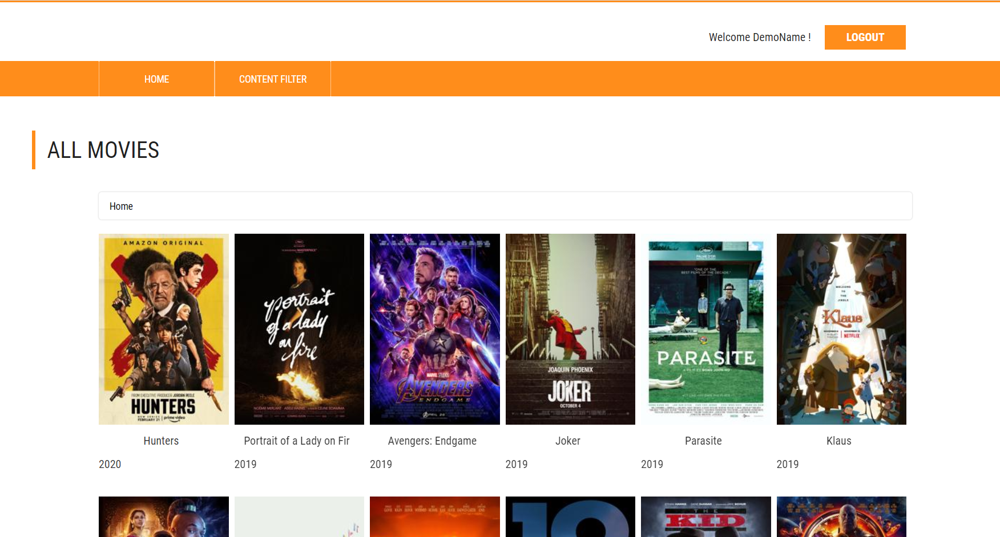
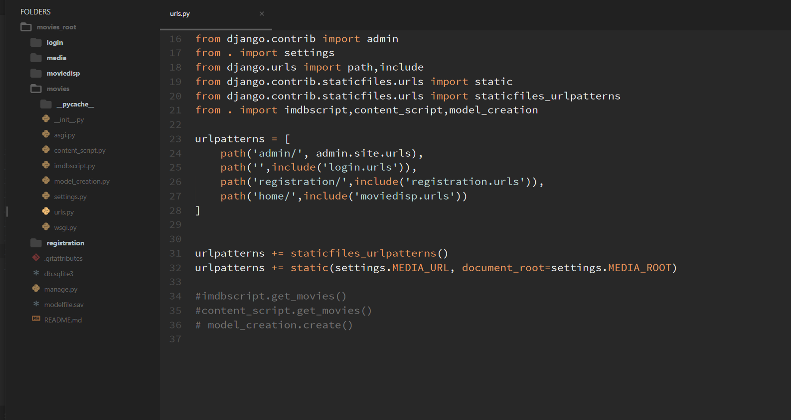

# Django-Movie-Recommendor (Machine Learning)
 Movie Website built on python Django framework.
 Uses ***Content Based Predictive Model*** approach to predict similar movies based on the contents/genres similarities.
 

- Libraries used: pandas, numpy, sklearn, imdbpy, pickle
- Python-Django Version: 3.6
- Database: Postgresql

The dataset used for training the model can be downloaded from this link: https://grouplens.org/datasets/movielens/1m/
The model uses batch learning mechanism in contrast to online learning. 

Hence, the dataset will have to be downloaded and the model would have to be trained just once as it would not be updating dynamically.
In case you need to update the movie dataset, the model would have to be retrained after updating the dataset.

##### Run and deploy
1. Clone and download the repository
2. (Do this just once!) Uncomment the three functions in the top level `urls.py` : `imdbscript.get_movies()` , `content_script.get_movies()`, `model_creation.create()`
